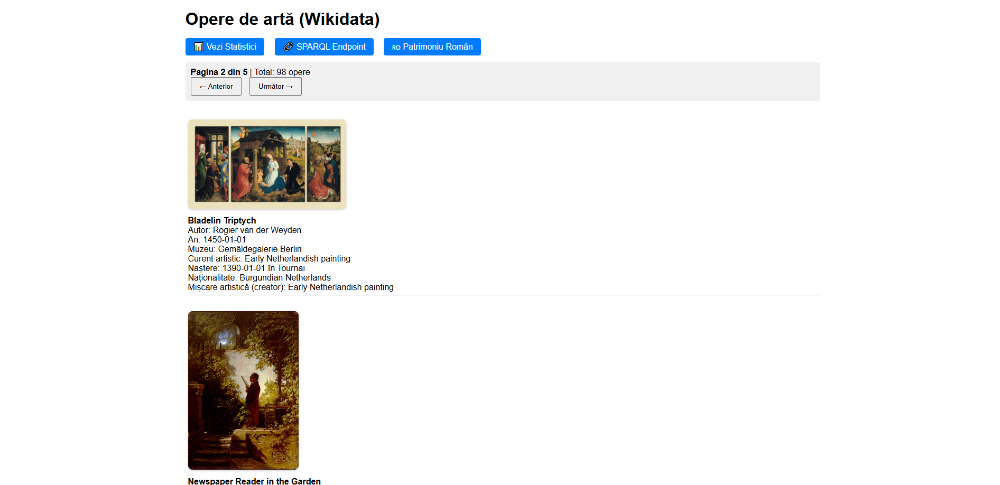
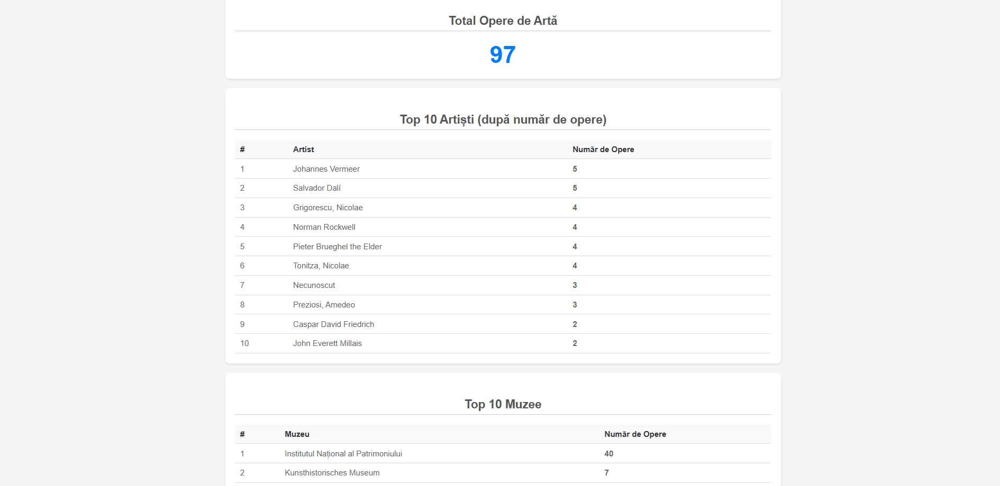

# 🎨 Artwork Provenance & Cultural Heritage Management

An advanced web application for managing artwork provenance, cultural heritage data, and artist information with semantic web technologies and Getty vocabulary enrichment.


#### [View Demo](#-getting-started) · [API Documentation](./api-specification/REST-api-documentation.md)

---

## 📔 Table of Contents

- [About the Project](#-about-the-project)
  - [Screenshots](#-screenshots)
  - [Tech Stack](#-tech-stack)
  - [Features](#-features)
  - [Project Architecture](#-project-architecture)
- [Getting Started](#-getting-started)
  - [Prerequisites](#-prerequisites)
  - [Installation](#-installation)
  - [Running the Application](#-running-the-application)
  - [Setting Up the SPARQL Endpoint](#-setting-up-the-sparql-endpoint)
- [Usage](#-usage)
  - [API Endpoints](#-api-endpoints)
  - [Query Examples](#-query-examples)
  - [SPARQL Interface](#-sparql-interface)
- [Roadmap](#-roadmap)
- [Contributing](#-contributing)
- [FAQ](#-faq)
- [License](#-license)
- [Acknowledgements](#-acknowledgements)

---

## 🌟 About the Project

This project provides a comprehensive system for managing artwork provenance, tracking cultural heritage items, and enriching data with semantic web technologies. It integrates data from multiple sources (Wikidata, DBpedia, Romanian heritage data) and enriches it with Getty Vocabularies (ULAN for artists, AAT for art movements), storing everything in an Apache Jena Fuseki triple store for intelligent querying.

The application serves as both a data management platform and a research tool for art historians, museum curators, and cultural heritage professionals.

### 📷 Screenshots

**Romanian Heritage Page**


**Artworks List Page**


**Statistics Dashboard**



### 👾 Tech Stack

**Client**
- HTML5
- CSS3
- JavaScript (Vanilla)
- Bootstrap (UI Framework)

**Server**
- Python 3.12+
- Django 6.0.1
- Django REST Framework 3.16.1
- rdflib 7.5.0
- SPARQLWrapper 2.0.0

**Database & Knowledge Graph**
- SQLite (Django ORM)
- Apache Jena Fuseki 5.6.0 (RDF Triple Store)
- RDF/Turtle Serialization

**External APIs**
- Wikidata
- DBpedia SPARQL Endpoint
- Getty SPARQL Endpoints (ULAN, AAT)
- data.gov.ro

### 🎯 Features

- ✅ **Artwork Management** - Create, read, update, and manage artwork records
- ✅ **Artist Enrichment** - Automatic enrichment with DBpedia artist information
- ✅ **Getty Vocabulary Integration** - Link artworks to Getty ULAN (artists) and AAT (movements)
- ✅ **SPARQL Query Interface** - Direct SPARQL querying against the Fuseki triple store
- ✅ **REST API** - Full-featured REST API for programmatic access (100+ artworks)
- ✅ **Romanian Cultural Heritage** - Dedicated module for Romanian artwork data
- ✅ **Statistics Dashboard** - Visual statistics on enrichment, coverage, and data quality
- ✅ **CORS-Enabled** - Cross-origin requests supported for external integrations
- ✅ **Semantic Search** - Query artworks by creator, movement, date, and museum
- ✅ **Multi-Source Data Integration** - Combines data from DBpedia, Wikidata, and Romanian sources

---

## 🧰 Getting Started

### ⚠️ Prerequisites

Ensure you have the following installed:

- **Python 3.12+** ([Download](https://www.python.org/))
- **pip** (comes with Python)
- **Java 11 or higher** (for Apache Jena Fuseki) ([Download](https://adoptopenjdk.net/))
- **Git** ([Download](https://git-scm.com/))

### ⚙️ Installation

1. **Clone the repository**
```bash
git clone https://github.com/DulhacNinja/artwork-provenance
cd artwork-provenance
```

2. **Create a virtual environment**
```bash
cd provenance
python -m venv venv

# On Windows
venv\Scripts\activate
# On Linux/Mac
source venv/bin/activate
```

3. **Install Python dependencies**
```bash
pip install -r requirements.txt
```

4. **Set up the Django database**
```bash
python manage.py migrate
```

5. **Verify installation**
```bash
python manage.py runserver
```

The application should be accessible at `http://localhost:8000`

### 🏃 Running the Application

#### 1. Start the Django Application

```bash
cd provenance

# Activate virtual environment first (if not already activated)
# On Windows: venv\Scripts\activate
# On Linux/Mac: source venv/bin/activate

python manage.py runserver
```

Django will be available at: `http://localhost:8000`

#### 2. Configure Apache Jena Fuseki (in a new terminal)

```bash
cd apache-jena-fuseki-5.6.0

# On Windows
fuseki-server.bat --config=run/config.ttl

# On Linux/Mac
./fuseki --config=run/config.ttl
```

Fuseki UI will be available at: `http://localhost:3030`

#### 3. Verify Both Services

- Django homepage: http://localhost:8000
- Fuseki admin: http://localhost:3030

### 🚀 Setting Up the SPARQL Endpoint

The project is configured to use Apache Jena Fuseki for semantic querying:

1. **Ensure Fuseki is running** (see above)
2. **Access the SPARQL interface**: http://localhost:8000/sparql
3. **Or use the Fuseki UI**: http://localhost:3030

---

## 👀 Usage

### 📡 API Endpoints

| Endpoint | Method | Description |
|----------|--------|-------------|
| `/` | GET | Artworks list page (HTML) |
| `/api/` | GET | Paginated artworks data (JSON) |
| `/sparql` | GET, POST | SPARQL query interface |
| `/stats/` | GET | Statistics page (HTML) |
| `/stats/api/` | GET | Statistics data (JSON) |
| `/getty/stats/` | GET | Getty enrichment statistics (HTML) |
| `/getty/stats/api/` | GET | Getty enrichment statistics (JSON) |
| `/romanian/` | GET | Romanian heritage artworks (HTML) |
| `/romanian/api/` | GET | Romanian heritage artworks (JSON) |

---

## 🧭 Roadmap

- [ ] User authentication and authorization
- [ ] Advanced search filters (date ranges, geographical location)
- [ ] Data visualization (network graphs of artist relationships)
- [ ] Integration with additional cultural heritage APIs
- [ ] Multi-language support
- [ ] Mobile application
- [ ] Real-time collaboration features
- [ ] Machine learning for artwork classification

---

## 👋 Contributing

Contributions are always welcome! Please follow these steps:

1. Fork the repository
2. Create your feature branch (`git checkout -b feature/AmazingFeature`)
3. Commit your changes (`git commit -m 'Add some AmazingFeature'`)
4. Push to the branch (`git push origin feature/AmazingFeature`)
5. Open a Pull Request

### 📜 Code of Conduct

Be respectful, inclusive, and professional in all interactions.

---

## ❔ FAQ

**Q: How do I import Romanian artwork data?**

A: Run the import command:
```bash
python manage.py import_romanian
```

**Q: Can I use a different RDF store instead of Fuseki?**

A: Yes, the application uses SPARQLWrapper, which supports any SPARQL 1.1 endpoint. Modify the `SPARQL_ENDPOINT` setting in `settings.py`.

**Q: What is the difference between DBpedia and Getty enrichment?**

A: DBpedia provides general biographical information about artists (birth date, nationality, abstract). Getty vocabularies (ULAN for artists, AAT for art movements) provide standardized linked data for cultural institutions.

**Q: How many artworks are currently in the database?**

A: The system currently contains 97 artworks with DBpedia enrichment and growing.

**Q: Is authentication required to access the API?**

A: No, the API is currently public with CORS enabled. Production deployment should implement proper authentication.

---

## 💎 Acknowledgements

This project builds upon the following excellent resources and libraries:

- [Django](https://www.djangoproject.com/) - Web framework
- [Django REST Framework](https://www.django-rest-framework.org/) - REST API toolkit
- [Apache Jena Fuseki](https://jena.apache.org/documentation/fuseki2/) - RDF triple store
- [rdflib](https://github.com/RDFLib/rdflib) - RDF library for Python
- [DBpedia](https://www.dbpedia.org/) - Structured data from Wikipedia
- [Getty Vocabularies](https://www.getty.edu/research/tools/vocabularies/) - ULAN and AAT
- [data.gov.ro](https://data.gov.ro/) - Romanian open data

