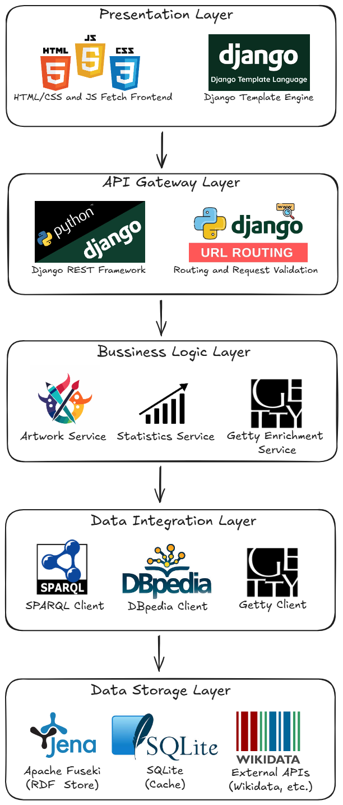
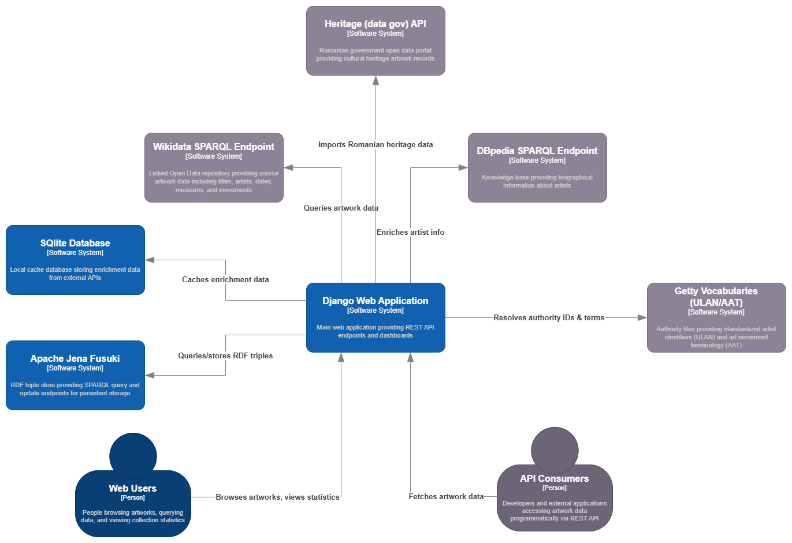

# Artwork Provenance System - Architecture Documentation

## Table of Contents

1. [System Overview](#system-overview)
2. [Service-Oriented Architecture](#service-oriented-architecture)
3. [Architecture Diagrams](#architecture-diagrams)
4. [Component Description](#component-description)
5. [Data Formats](#data-formats)
6. [User Interaction Flows](#user-interaction-flows)
7. [Technology Stack](#technology-stack)

---

## System Overview

The **Artwork Provenance System** is a web-based application designed to aggregate, enrich, and query artwork metadata from multiple authoritative sources. It provides a unified interface for exploring cultural heritage data with enhanced semantic web capabilities.

### Core Objectives

- **Data Aggregation**: Collect artwork data from Wikidata, DBpedia, and data.gov.ro
- **Semantic Enrichment**: Enhance data with Getty vocabularies (ULAN for artists, AAT for movements)
- **Knowledge Graph Storage**: Store and query data as RDF triples in Apache Jena Fuseki
- **REST API**: Provide programmatic access to enriched artwork metadata
- **Web Interface**: Offer user-friendly visualization and exploration tools

### System Characteristics

- **Architecture Pattern**: Service-Oriented Architecture (SOA)
- **Data Paradigm**: Linked Open Data (LOD) / Semantic Web
- **API Style**: RESTful
- **Query Language**: SPARQL 1.1
- **Deployment**: Multi-container (Django + Fuseki)

---

## Service-Oriented Architecture

The system follows a **layered service-oriented architecture** with clear separation of concerns:




### Layer Responsibilities

#### 1. Presentation Layer
- **Purpose**: User interface and interaction
- **Components**: HTML templates, JavaScript, CSS
- **Technologies**: Django Templates, Vanilla JavaScript, Fetch API
- **Responsibilities**:
  - Render HTML pages for human users
  - Handle user interactions (pagination, filtering, form submissions)
  - Make AJAX calls to API layer
  - Display charts and visualizations

#### 2. API Gateway Layer
- **Purpose**: Request routing and API management
- **Components**: Django URL routing, middleware, CORS handling
- **Technologies**: Django 5.x, Django REST Framework, CORS Headers
- **Responsibilities**:
  - Route HTTP requests to appropriate handlers
  - Enforce CORS policies
  - Handle authentication (future capability)
  - Format API responses (JSON)
  - Manage CSRF tokens

#### 3. Business Logic Layer
- **Purpose**: Core application logic and data processing
- **Components**: Django views and services
- **Technologies**: Python 3.x, SPARQLWrapper
- **Responsibilities**:
  - Implement business rules
  - Aggregate and deduplicate data
  - Compute statistics
  - Orchestrate enrichment workflows
  - Paginate results

#### 4. Data Integration Layer
- **Purpose**: Interface with external data sources
- **Components**: Client libraries and adapters
- **Technologies**: SPARQLWrapper, Requests, urllib
- **Responsibilities**:
  - Query Fuseki triple store via SPARQL
  - Fetch artist metadata from DBpedia
  - Retrieve Getty vocabulary identifiers
  - Import Romanian heritage data
  - Handle retries and timeouts
  - Cache external API responses

#### 5. Data Storage Layer
- **Purpose**: Persist and retrieve data
- **Components**: Database systems
- **Technologies**: Apache Jena Fuseki 5.6.0, SQLite 3
- **Responsibilities**:
  - Store RDF triples (Fuseki)
  - Cache enrichment data (SQLite)
  - Execute SPARQL queries
  - Manage transactions and backups

---

## Architecture Diagrams

### High-Level System Architecture



The C4 Container diagram shows the system's deployable units and their interactions. The Django web application serves users via REST API and web interface, stores RDF triples in Fuseki triple store, caches enrichment data in SQLite, and integrates with external SPARQL endpoints (Wikidata, DBpedia, Getty) and data.gov.ro for comprehensive artwork provenance information.

The system follows a distributed architecture with clear separation between client, application, and data layers:

#### Client Layer (End Users)
Multiple client types can interact with the system:
- **Web Browsers**: Primary interface for human users
- **Mobile Clients**: Future support for mobile applications
- **CLI Tools**: Command-line access for automation
- **External Applications**: Third-party API consumers

All clients communicate via **HTTP/HTTPS on port 8000** to the Django application server.

#### Application Layer (Django Web Server)
The Django application server runs on port 8000 and contains three sub-layers:

**1. URL Router & Views**
   - Routes incoming HTTP requests to appropriate handlers
   - Implements RESTful endpoints (`/api/`, `/sparql`, `/stats/api/`)
   - Serves HTML templates for browser clients

**2. Business Logic Services**
   - **ArtworkService**: Handles artwork queries, pagination, and aggregation
   - **StatisticsService**: Computes analytics and collection metrics
   - **EnrichmentService**: Orchestrates data enrichment from external sources

**3. Data Access Layer**
   - **SPARQL Client** (SPARQLWrapper): Queries Fuseki triple store and external SPARQL endpoints
   - **Django ORM**: Accesses SQLite cache for enrichment data

#### Data Storage Layer
The system uses two complementary storage systems:

**1. Apache Jena Fuseki (Port 3030)**
   - RDF triple store for artwork knowledge graph
   - TDB2 backend for persistent RDF storage
   - SPARQL 1.1 query and update endpoints
   - Stores primary artwork data and relationships

**2. SQLite Cache Database**
   - Local cache for external API responses
   - Tables: `DBpediaArtist`, `GettyULAN`, `GettyAAT`, `Artwork`
   - Reduces load on external services
   - TTL-based cache invalidation (120-180 days)

#### External Data Sources (Read-only)
The system integrates with three external SPARQL endpoints:
- **Wikidata**: Primary source for artwork metadata
- **DBpedia**: Artist biographical information
- **Getty Vocabularies**: Authority files (ULAN for artists, AAT for movements)

These sources are queried during data import and enrichment phases, with results cached locally.

### Component Interaction Diagram

```
User Request Flow:
──────────────────

1. Browser Request
   │
   ├──> GET /api/?page=1
   │
   ▼
2. Django Router (urls.py)
   │
   ├──> Route to artworks_api view
   │
   ▼
3. View Layer (views.py)
   │
   ├──> Parse request parameters
   ├──> Calculate pagination offsets
   │
   ▼
4. SPARQL Service (sparql.py)
   │
   ├──> Build SPARQL query
   ├──> Execute against Fuseki
   │
   ▼
5. Fuseki Triple Store
   │
   ├──> Query RDF graph
   ├──> Return bindings
   │
   ▼
6. Data Processing
   │
   ├──> Deduplicate results
   ├──> Aggregate related data
   ├──> Format response
   │
   ▼
7. JSON Response
   │
   └──> Return to browser


Enrichment Flow:
────────────────

1. Import Command
   │
   ├──> python manage.py import_artworks
   │
   ▼
2. SPARQL Query Builder
   │
   ├──> Query Wikidata for paintings
   ├──> Fetch in batches (retry logic)
   │
   ▼
3. Data Transformation
   │
   ├──> Convert Wikidata JSON to RDF triples
   ├──> Extract artist names
   │
   ▼
4. DBpedia Enrichment (dbpedia.py)
   │
   ├──> Check SQLite cache
   ├──> If not cached, query DBpedia
   ├──> Extract: birthDate, birthPlace, nationality, movement
   ├──> Save to cache
   │
   ▼
5. Getty Enrichment (getty_enrichment.py)
   │
   ├──> Query Getty ULAN for artists
   ├──> Query Getty AAT for movements
   ├──> Link to vocabulary URIs
   ├──> Cache results
   │
   ▼
6. RDF Storage
   │
   ├──> Build RDF graph with enriched data
   ├──> Insert triples into Fuseki
   │
   ▼
7. Verification
   │
   └──> Query Fuseki to verify insertion
```

### Data Model Architecture

```
RDF Triple Store Schema (Current Implementation):
──────────────────────────────────────────────────

ex:Artwork_Girl_with_a_Pearl_Earring ──rdf:type──> ex:Artwork
     ├── ex:title ──────────> "Girl with a Pearl Earring"
     ├── ex:createdBy ──────> ex:Artist_Johannes_Vermeer
     ├── ex:date ───────────> "1665"
     ├── ex:museum ─────────> "Mauritshuis"
     ├── ex:movement ───────> "Dutch Golden Age painting"
     └── ex:image ──────────> <image_url>

ex:Artist_Johannes_Vermeer ──rdf:type──> ex:Artist
     ├── ex:name ───────────> "Johannes Vermeer"
     ├── ex:birthDate ──────> "1632-10-31"
     ├── ex:birthPlace ─────> "Delft"
     ├── ex:nationality ────> "Dutch"
     └── ex:movement ───────> "Dutch Golden Age painting"

Note: The RDF schema is intentionally minimal to focus on core artwork and artist 
properties. Additional metadata (Getty vocabulary links, data sources, heritage flags) 
are handled through the SQLite cache layer and application logic.


SQLite Cache Schema:
────────────────────

DBpediaArtist Table:
┌───────────────┬──────────┬──────────┐
│ id (PK)       │ Integer  │ Auto     │
├───────────────┼──────────┼──────────┤
│ name (UNIQUE) │ Varchar  │ Indexed  │
│ abstract      │ Text     │ NULL     │
│ birthDate     │ Varchar  │ NULL     │
│ birthPlace    │ Varchar  │ NULL     │
│ nationality   │ Varchar  │ NULL     │
│ movement      │ Varchar  │ NULL     │
│ image_url     │ URL      │ NULL     │
│ fetched_at    │ DateTime │ Auto     │
└───────────────┴──────────┴──────────┘

GettyULAN Table:
┌───────────────┬──────────┬──────────┐
│ id (PK)       │ Integer  │ Auto     │
├───────────────┼──────────┼──────────┤
│ name (UNIQUE) │ Varchar  │ Indexed  │
│ ulan_id       │ Varchar  │ NULL     │
│ ulan_url      │ URL      │ NULL     │
│ preferred_label│ Varchar │ NULL     │
│ fetched_at    │ DateTime │ Auto     │
└───────────────┴──────────┴──────────┘

GettyAAT Table:
┌───────────────┬──────────┬──────────┐
│ id (PK)       │ Integer  │ Auto     │
├───────────────┼──────────┼──────────┤
│ term (UNIQUE) │ Varchar  │ Indexed  │
│ aat_id        │ Varchar  │ NULL     │
│ aat_url       │ URL      │ NULL     │
│ preferred_label│ Varchar │ NULL     │
│ fetched_at    │ DateTime │ Auto     │
└───────────────┴──────────┴──────────┘
```

---

## Component Description

### Core Services

#### 1. Artwork Service
**View Functions**:
- `artworks_page(request)` - Renders HTML page for artwork browsing
- `artworks_api(request)` - Provides JSON API for paginated artwork data

**Responsibilities**:
- Paginate artwork queries (default 50 items per page)
- Query Fuseki triple store for artwork data
- Deduplicate results based on (title, date) key
- Merge related data (creators, museums, movements)
- Aggregate DBpedia enrichment (birth dates, places, nationalities)
- Format responses for API consumers

**API Endpoint**: `GET /api/?page=1&per_page=50`

**Dependencies**:
- SPARQLWrapper for Fuseki queries
- Fuseki Triple Store (port 3030)

#### 2. Statistics Service
**View Functions**:
- `statistics_page(request)` - Renders HTML statistics dashboard
- `statistics_api(request)` - Provides JSON statistics data

**Responsibilities**:
- Calculate total artwork count
- Aggregate top 10 creators by artwork count
- Aggregate top 10 museums by collection size
- Aggregate top 10 art movements
- Group artworks by century (extracted from dates)
- Generate per-museum movement breakdown (top 5 movements per museum)

**API Endpoint**: `GET /stats/api/`

**Analytics Provided**:
- `total_artworks`: Count of all artworks
- `top_creators`: List of artists with artwork counts
- `top_museums`: Museums ranked by collection size
- `top_movements`: Art movements by frequency
- `by_century`: Distribution across centuries
- `museum_breakdown`: Per-museum statistics with top movements

#### 3. Getty Statistics Service
**View Functions**:
- `getty_statistics_page(request)` - Renders Getty enrichment dashboard
- `getty_statistics_api(request)` - Provides Getty vocabulary statistics

**Responsibilities**:
- Count artworks with Getty AAT movement links
- Count artists with Getty ULAN identifiers
- List top Getty AAT movements with artwork counts
- List top Getty ULAN artists with artwork counts

**API Endpoint**: `GET /getty/stats/api/`

**Metrics Tracked**:
- Total artworks vs Getty AAT coverage
- Total unique Getty ULAN artists
- Top movements linked to AAT vocabulary
- Top artists linked to ULAN authority file

#### 4. Romanian Heritage Service
**View Functions**:
- `romanian_heritage_page(request)` - Renders Romanian heritage gallery
- `romanian_heritage_api(request)` - Provides Romanian artworks JSON data

**Responsibilities**:
- Query artworks with Romanian provenance
- Filter artworks from data.gov.ro source
- Display cultural heritage from Institutul Național al Patrimoniului
- Aggregate Romanian artist data with DBpedia enrichment

**API Endpoint**: `GET /romanian/api/`

**Data Source**: Artworks tagged with Romanian heritage flags

#### 5. SPARQL Endpoint Service
**View Function**:
- `sparql_endpoint(request)` - Handles SPARQL query execution

**Responsibilities**:
- Accept custom SPARQL queries via GET or POST
- Execute queries against Fuseki triple store
- Return SPARQL JSON results format
- Provide web form for interactive queries

**API Endpoint**: `GET|POST /sparql?query=<sparql_string>`

**Supported Methods**:
- GET: Display form or execute query from URL parameter
- POST: Execute query from form submission

#### 6. SPARQL Import Service
**Key Functions**:
- `get_paintings(limit=10, total=100)` - Query Wikidata for paintings
- `get_romanian_artworks(limit=10, total=100)` - Query Romanian heritage artworks
- `fetch_labels(uris, property_name)` - Resolve URIs to labels (batched)
- `push_graph_to_fuseki(graph)` - Upload RDF triples to Fuseki

**Responsibilities**:
- Query construction for Wikidata SPARQL endpoint
- Batch querying with pagination (limit/offset)
- Retry logic for failed requests (5 attempts)
- Label resolution for entity URIs
- RDF graph construction with rdflib
- Data upload to Fuseki via SPARQL UPDATE

**Features**:
- Timeout handling (60s)
- Exponential backoff on retries
- User-agent identification
- Batch processing (10-50 items per batch)

#### 7. DBpedia Enrichment Service
**Key Functions**:
- `get_author_details(full_name: str)` - Fetch or retrieve cached artist data
- `_resolve_resource_uri(full_name: str)` - Resolve artist name to DBpedia URI

**Responsibilities**:
- Fetch artist biographical data from DBpedia SPARQL
- Cache results in SQLite database (120-day TTL)
- Resolve artist name ambiguities using label matching
- Handle query failures gracefully with retries
- Extract: birthDate, birthPlace, nationality, movement, abstract, image

**Caching Strategy**:
- Check `DBpediaArtist` table first
- Return cached data if within TTL (120 days)
- Query DBpedia on cache miss
- Retry 3 times on failure
- Timeout: 30 seconds per query

**Returns**: Dictionary with artist biographical data

#### 8. Getty Enrichment Service
**Key Functions**:
- `enrich_artist_with_ulan(artist_name: str)` - Link artist to Getty ULAN
- `enrich_movement_with_aat(movement_name: str)` - Link movement to Getty AAT
- `_query_getty_sparql(query: str)` - Execute SPARQL query against Getty endpoint

**Responsibilities**:
- Link artists to Getty ULAN identifiers (authority control)
- Link art movements to Getty AAT terms (controlled vocabulary)
- Cache vocabulary mappings in SQLite (180-day TTL)
- Query Getty SPARQL endpoint via HTTP POST
- Handle empty responses and network failures

**Vocabulary Standards**:
- **ULAN**: Union List of Artist Names - artist authority file
- **AAT**: Art & Architecture Thesaurus - art terminology

**Caching Tables**:
- `GettyULAN`: Artist name → ULAN ID mapping
- `GettyAAT`: Movement term → AAT ID mapping

---

## Data Formats

### 1. Input Formats

#### Wikidata SPARQL Response
```json
{
  "head": {
    "vars": ["item", "creator", "inception", "collection", "movement"]
  },
  "results": {
    "bindings": [
      {
        "item": {
          "type": "uri",
          "value": "http://www.wikidata.org/entity/Q175036"
        },
        "creator": {
          "type": "uri",
          "value": "http://www.wikidata.org/entity/Q41264"
        },
        "inception": {
          "type": "literal",
          "datatype": "http://www.w3.org/2001/XMLSchema#dateTime",
          "value": "1665-01-01T00:00:00Z"
        },
        "collection": {
          "type": "uri",
          "value": "http://www.wikidata.org/entity/Q221092"
        },
        "movement": {
          "type": "uri",
          "value": "http://www.wikidata.org/entity/Q1474884"
        }
      }
    ]
  }
}
```

#### DBpedia SPARQL Response
```json
{
  "results": {
    "bindings": [
      {
        "birthDate": {
          "type": "literal",
          "datatype": "http://www.w3.org/2001/XMLSchema#date",
          "value": "1632-10-31"
        },
        "birthPlace": {
          "type": "literal",
          "xml:lang": "en",
          "value": "Delft"
        },
        "nationality": {
          "type": "literal",
          "xml:lang": "en",
          "value": "Dutch"
        },
        "movement": {
          "type": "literal",
          "xml:lang": "en",
          "value": "Dutch Golden Age painting"
        }
      }
    ]
  }
}
```

#### Getty SPARQL Response
```json
{
  "results": {
    "bindings": [
      {
        "subject": {
          "type": "uri",
          "value": "http://vocab.getty.edu/ulan/500032927"
        },
        "id": {
          "type": "literal",
          "value": "500032927"
        },
        "prefLabel": {
          "type": "literal",
          "xml:lang": "en",
          "value": "Vermeer, Johannes"
        }
      }
    ]
  }
}
```

### 2. Internal RDF Format

```turtle
@prefix ex: <http://example.org/ontology/> .
@prefix rdf: <http://www.w3.org/1999/02/22-rdf-syntax-ns#> .
@prefix xsd: <http://www.w3.org/2001/XMLSchema#> .

# Artwork Entity (as stored in Fuseki)
ex:Artwork_Girl_with_a_Pearl_Earring
    rdf:type ex:Artwork ;
    ex:title "Girl with a Pearl Earring" ;
    ex:createdBy ex:Artist_Johannes_Vermeer ;
    ex:date "1665" ;
    ex:museum "Mauritshuis" ;
    ex:movement "Dutch Golden Age painting" ;
    ex:image "https://example.com/image.jpg" .

# Artist Entity (as stored in Fuseki)
ex:Artist_Johannes_Vermeer
    rdf:type ex:Artist ;
    ex:name "Johannes Vermeer" ;
    ex:birthDate "1632-10-31" ;
    ex:birthPlace "Delft" ;
    ex:nationality "Dutch" ;
    ex:movement "Dutch Golden Age painting" .
```

**Note**: All property values are stored as `xsd:string` literals. Artist biographical data and Getty vocabulary links are managed through SQLite cache tables and merged at query time.

### 3. Output Formats

#### REST API Response (JSON)
```json
{
  "items": [
    {
      "title": "Girl with a Pearl Earring",
      "creator": "Johannes Vermeer",
      "creators": ["Johannes Vermeer"],
      "date": "1665",
      "museum": "Mauritshuis",
      "museums": ["Mauritshuis"],
      "movement": "Dutch Golden Age painting",
      "movements": ["Dutch Golden Age painting", "Baroque"],
      "creator_movements": ["Dutch Golden Age painting"],
      "birth_dates": ["1632-10-31"],
      "birth_places": ["Delft"],
      "nationalities": ["Dutch"],
      "image_url": "https://example.com/image.jpg",
      "dbpedia": {
        "birthDate": "1632-10-31",
        "birthPlace": "Delft",
        "nationality": "Dutch",
        "movement": "Dutch Golden Age painting"
      }
    }
  ],
  "total": 97,
  "page": 1,
  "per_page": 50,
  "total_pages": 2
}
```

#### Statistics API Response
```json
{
  "total_artworks": 97,
  "top_creators": [
    {"creator": "Johannes Vermeer", "count": 5},
    {"creator": "Rembrandt", "count": 4}
  ],
  "top_museums": [
    {"museum": "Rijksmuseum", "count": 12},
    {"museum": "Mauritshuis", "count": 8}
  ],
  "top_movements": [
    {"movement": "Dutch Golden Age painting", "count": 15},
    {"movement": "Baroque", "count": 12}
  ],
  "by_century": [
    {"century": "1600s", "count": 25},
    {"century": "1700s", "count": 18}
  ],
  "museum_breakdown": [
    {
      "museum": "Rijksmuseum",
      "total": 12,
      "top_movements": [
        {"movement": "Dutch Golden Age painting", "count": 8}
      ]
    }
  ]
}
```

---

## User Interaction Flows

### End-User Perspective

#### 1. Browse Artworks Flow

```
User Action                    System Response
───────────                    ───────────────

1. Navigate to homepage
   http://localhost:8000/
                              → Load artworks_list.html
                              → Inject load_artworks.js

2. Page loads JavaScript
                              → Fetch /api/?page=1
                              → Receive JSON with 50 artworks

3. Artworks displayed
   • Title
   • Creator (clickable)      → Render artwork cards
   • Museum                   → Display images if available
   • Movement                 → Show enrichment badges
   • Date

4. Click "Next Page"
                              → Fetch /api/?page=2
                              → Append new artworks to DOM

5. Filter by movement
   (future capability)
                              → Filter locally or re-query API
```

#### 2. Explore Statistics Flow

```
User Action                    System Response
───────────                    ───────────────

1. Navigate to /stats/
                              → Load statistics.html
                              → Fetch /stats/api/

2. Data received
                              → Parse JSON statistics
                              → Render charts with Chart.js

3. View displayed
   • Total artworks count
   • Top 10 creators (bar chart)
   • Top museums (pie chart)
   • Movement distribution
   • Century timeline

4. Click on museum
                              → Show museum-specific breakdown
                              → Display top movements in that museum

5. Hover over chart
                              → Show tooltip with exact counts
```

#### 3. Execute SPARQL Query Flow

```
User Action                    System Response
───────────                    ───────────────

1. Navigate to /sparql
                              → Display SPARQL query form
                              → Show example queries

2. Enter SPARQL query
   PREFIX ex: <...>
   SELECT ?title WHERE {
     ?art ex:title ?title
   } LIMIT 10
                              → Syntax highlighting (optional)

3. Click "Execute"
                              → POST to /sparql
                              → Execute against Fuseki

4. Results displayed
   • Table format             → Parse SPARQL JSON results
   • Variable bindings        → Render as HTML table
   • Download as JSON         → Provide JSON download button
```

#### 4. Explore Romanian Heritage Flow

```
User Action                    System Response
───────────                    ───────────────

1. Navigate to /romanian/
                              → Load romanian_heritage.html
                              → Fetch /romanian/api/

2. Data received
   40 Romanian artworks
                              → Filter for ex:heritage="true"
                              → Display artwork cards

3. View artwork details
   • Title in Romanian
   • Creator                  → Show DBpedia enrichment
   • Museum: Institutul       → Display source indicator
     Național al Patrimoniului

4. Group by artist
                              → Client-side grouping
                              → Show artist biography from DBpedia
```

---

## Technology Stack

### Backend Technologies

| Component | Technology | Version | Purpose |
|-----------|-----------|---------|---------|
| **Web Framework** | Django | 6.x | HTTP routing, views, ORM |
| **API Framework** | Django REST Framework | 3.x | RESTful API capabilities |
| **SPARQL Client** | SPARQLWrapper | 2.x | Query Wikidata, DBpedia, Getty |
| **HTTP Client** | Requests | 2.x | HTTP requests to external APIs |
| **RDF Library** | rdflib | 7.x | RDF graph construction |
| **Database** | SQLite | 3.x | Enrichment cache |
| **Triple Store** | Apache Jena Fuseki | 5.6.0 | RDF storage and SPARQL endpoint |
| **RDF Storage** | TDB2 | 5.6.0 | Persistent RDF triple store |

### Frontend Technologies

| Component | Technology | Version | Purpose |
|-----------|-----------|---------|---------|
| **Template Engine** | Django Templates | 6.x | Server-side HTML rendering |
| **JavaScript** | Vanilla JS | ES6+ | Client-side interactivity |
| **HTTP Client** | Fetch API | Modern | AJAX requests to API |
| **Styling** | CSS3 | - | Visual presentation |

### External Services

| Service | Endpoint | Purpose |
|---------|----------|---------|
| **Wikidata** | https://query.wikidata.org/sparql | Artwork source data |
| **DBpedia** | https://dbpedia.org/sparql | Artist biographical data |
| **Getty ULAN** | http://vocab.getty.edu/sparql | Artist authority file |
| **Getty AAT** | http://vocab.getty.edu/sparql | Art movement vocabulary |
| **data.gov.ro** | https://data.gov.ro | Romanian heritage data |

### Development Tools

| Tool | Purpose |
|------|---------|
| **Python 3.10+** | Programming language |
| **pip** | Package management |
| **Git** | Version control |
| **VS Code** | Code editor |
| **Postman/Swagger** | API testing |
| **Django Debug Toolbar** | Performance profiling |

### Ontologies & Vocabularies

| Vocabulary | Namespace | Purpose |
|------------|-----------|---------|
| **Custom Ontology** | `ex:` | Internal data model |
| **RDF** | `rdf:` | Resource description framework |
| **RDFS** | `rdfs:` | RDF schema |
| **XSD** | `xsd:` | XML schema datatypes |
| **Getty ULAN** | `ulan:` | Artist identifiers |
| **Getty AAT** | `aat:` | Art & architecture terms |

---

## Future Enhancements

### Planned Features

1. **User Authentication**:
   - User accounts and profiles
   - Saved queries and collections
   - Artwork favorites

2. **Advanced Search**:
   - Full-text search
   - Faceted filtering
   - Temporal queries

3. **Data Visualization**:
   - Interactive network graphs
   - Geographic maps of museums
   - Timeline visualizations

4. **Export Capabilities**:
   - CSV export
   - RDF/XML download
   - PDF reports

### Technical Debt

- Migrate from SQLite to PostgreSQL
- Implement proper logging framework
- Add comprehensive unit tests (>80% coverage)
- Set up CI/CD pipeline
- Containerize with Docker
- Add API documentation with Swagger UI

---

## Conclusion

The Artwork Provenance System demonstrates a well-architected service-oriented design that effectively integrates multiple data sources into a unified semantic web application. The layered architecture provides clear separation of concerns, making the system maintainable and extensible.

**Key Strengths**:
- Clean SOA design with distinct layers
- Effective use of semantic web technologies
- Comprehensive data enrichment pipeline
- RESTful API with clear contracts
- Extensible architecture for future growth

**Architecture Highlights**:
- **Modularity**: Each service (artwork, statistics, enrichment) is independently deployable
- **Interoperability**: Standard SPARQL interface for data exchange
- **Scalability**: Horizontal scaling possible with minimal changes
- **Maintainability**: Clear code organization and documentation

This architecture provides a solid foundation for a production-ready cultural heritage data platform.

---

**Document Version**: 1.0  
**Last Updated**: January 13, 2026  
**Author:** Team -> Machine Love (Dulhac Alexandru and Ignat Vlad-Rovin)

